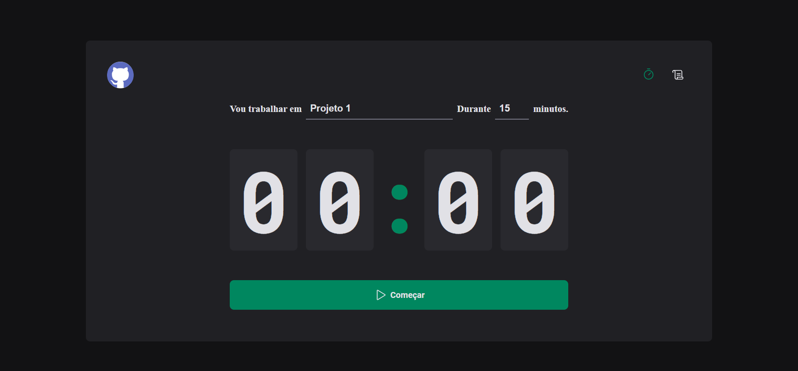
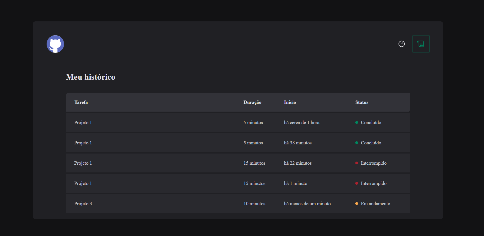

# Pomodoro Timer
Este é um projeto de Timer Pomodoro desenvolvido com React e TypeScript, projetado para ajudar na gestão de tempo e aumentar a produtividade. O aplicativo permite configurar o nome do projeto e o tempo desejado, além de oferecer um histórico das sessões realizadas. Todos os dados são armazenados no Local Storage, garantindo que as informações sejam preservadas mesmo ao fechar ou recarregar a página.

## 🚀 Funcionalidades
Configuração do Timer: Escolha o nome do projeto e a duração da tarefa.
Execução Contínua: O timer continua rodando mesmo se você sair ou recarregar a página, graças à persistência no Local Storage.
Histórico de Sessões: Visualize o histórico completo das tarefas realizadas, incluindo:
Horário de início.
Horário de interrupção (se aplicável).
Status de conclusão.
Interface Personalizada: Estilizada com Styled Components.

# 🛠️ Tecnologias e Ferramentas
O projeto foi desenvolvido utilizando as seguintes tecnologias e bibliotecas:

- React com TypeScript: Para a construção da interface e lógica do aplicativo.
- Styled Components: Para estilização dinâmica e modular.
- React Router DOM: Para gerenciamento de rotas e navegação.
- Context API com Reducers: Para gerenciamento global de estado.
- Immer: Para manipulação mais simples do estado imutável.
- React Hook Form com Zod: Para validação e gerenciamento de formulários.
- Local Storage: Para persistência de dados no navegador.

## 📸 Screenshots
Página do Timer

Histórico

